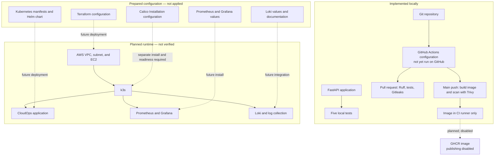

# Architecture and Implementation Status

CloudOps Platform is a portfolio project centered on a small FastAPI service. This page separates components implemented locally from configuration prepared for a future deployment. **No AWS infrastructure or Kubernetes cluster has been deployed from this repository.**

## Implemented locally

- FastAPI endpoints for application metadata, health, readiness, status, runtime information, and Prometheus metrics.
- Five automated tests covering the root, health, readiness, status, and metrics endpoints.
- Dockerfile and Docker Compose configuration.
- GitHub Actions configuration for pull-request checks and a main-branch image scan. The workflow has not yet run on GitHub.

The latest local review passed the five tests, Ruff, dependency consistency, Terraform formatting, and Helm lint. The local Python environment was 3.14; the workflow selects Python 3.13. Local checks do not verify a GitHub-hosted run or runtime deployment.

## Prepared configuration — not deployed

- Terraform describes a VPC, public subnet, security group, IAM role, and EC2 instance.
- k3s bootstrap settings and a Calico `Installation` custom resource are present.
- Kubernetes manifests and the CloudOps Helm chart describe the application, service, ingress, autoscaling, monitoring, and policy settings.
- Prometheus/Grafana values and a dashboard JSON are present. They do not establish an installed monitoring stack or automatic dashboard provisioning.
- Loki values and documentation are present; a complete log collection pipeline is not demonstrated.

## Planned deployment architecture

The diagram shows the intended flow, not a deployed system. Dashed edges indicate proposed or disabled steps.

The workflow builds and scans an image on a main-branch push after tests succeed, but it does not publish that image. GHCR publication is explicitly disabled. The Kubernetes and Helm image references still use a placeholder owner and mutable `latest` tag, so they are not deployable as written.

## Deployment prerequisites and limits

- **AWS:** No infrastructure has been deployed. The Terraform configuration includes public HTTP ingress and may incur EC2, EBS, public IPv4, data-transfer, and CPU-credit charges.
- **k3s and Calico:** The bootstrap disables Flannel and k3s's embedded NetworkPolicy controller. A separately installed and healthy Calico CNI is required before relying on pod networking. Runtime compatibility and enforcement are unverified. See [Calico preparation](calico-installation.md) and [deployment prerequisites](deployment.md).
- **NetworkPolicy:** SEC-002 remains open. The standalone policy denies application ingress, while Helm NetworkPolicy is disabled by default. Do not enable or apply a policy until source workload identities and CNI enforcement have been verified. See [Kubernetes security notes](kubernetes.md).
- **Ingress:** The configured application Ingress is HTTP-only; TLS is deferred. Terraform permits public TCP 80. Review exposure before any future deployment.
- **Autoscaling:** HPA configuration exists, but a working Metrics API and runtime scaling have not been verified.
- **Monitoring:** Prometheus/Grafana are configured but not installed. Scraping, persistent storage, dashboard provisioning, and node capacity remain unverified. See [monitoring status](monitoring.md) and the [resource budget](monitoring-resource-budget.md).

## Related documentation

- [Project overview and local development](../README.md)
- [Security controls](security.md)
- [Development capacity profiles](development-profiles.md)
